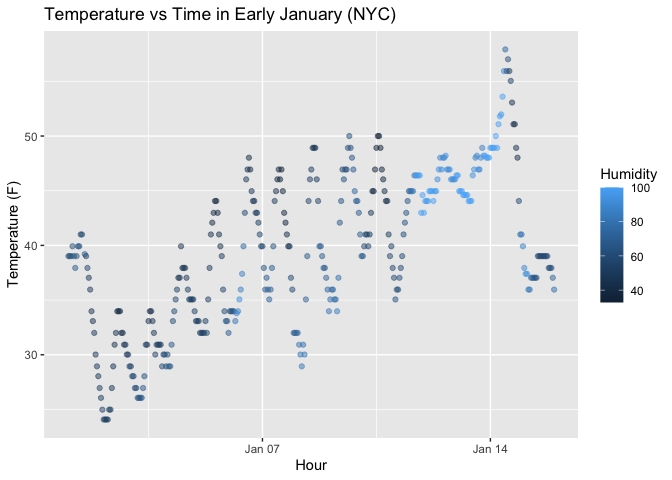

p8105_hw1_yz5290
================
Yue Zhao
2025-09-20

problem 1:

``` r
library(moderndive)
library(tidyverse)
```

    ## ── Attaching core tidyverse packages ──────────────────────── tidyverse 2.0.0 ──
    ## ✔ dplyr     1.1.4     ✔ readr     2.1.5
    ## ✔ forcats   1.0.0     ✔ stringr   1.5.1
    ## ✔ ggplot2   4.0.0     ✔ tibble    3.2.1
    ## ✔ lubridate 1.9.4     ✔ tidyr     1.3.1
    ## ✔ purrr     1.0.2     
    ## ── Conflicts ────────────────────────────────────────── tidyverse_conflicts() ──
    ## ✖ dplyr::filter() masks stats::filter()
    ## ✖ dplyr::lag()    masks stats::lag()
    ## ℹ Use the conflicted package (<http://conflicted.r-lib.org/>) to force all conflicts to become errors

``` r
data("early_january_weather")
```

The early_january_weather dataset contains 358 rows and 15 columns.
Important variables include:`temp` which is the temperature in
Fahrenheit; `humid` which is the relative humidity; `precip` which is
the precipitation; `year`, `month`, `day`, and `hour` are the date and
time. The mean temperature of early january is 39.5821229 °F.

scatter plot:

``` r
ggplot(early_january_weather, aes(x = time_hour, y = temp, color = humid))+
  geom_point(alpha = 0.5)+
  labs(
    x = "Hour",
    y = "Temperature (F)",
    color = "Humidity",
    title = "Temperature vs Time in Early January (NYC)"
  )
```

<!-- -->
save the plot

``` r
ggsave("scatter_plot.pdf", height = 4, width = 6)
```

Problem 2:

``` r
set.seed(1)#make it reproductable
```

``` r
my_df= tibble(num = rnorm(10),is_positive = rnorm(10) > 0,chars = sample(letters, 10),factors = factor(rep(c("low", "med", "high"), length.out = 10)))
my_df
```

    ## # A tibble: 10 × 4
    ##       num is_positive chars factors
    ##     <dbl> <lgl>       <chr> <fct>  
    ##  1 -0.626 TRUE        j     low    
    ##  2  0.184 TRUE        f     med    
    ##  3 -0.836 FALSE       o     high   
    ##  4  1.60  FALSE       t     low    
    ##  5  0.330 TRUE        w     med    
    ##  6 -0.820 FALSE       l     high   
    ##  7  0.487 FALSE       y     low    
    ##  8  0.738 TRUE        h     med    
    ##  9  0.576 TRUE        u     high   
    ## 10 -0.305 TRUE        v     low

Take the mean:

``` r
mean(my_df |> pull(num))          #works
```

    ## [1] 0.1322028

``` r
mean(my_df |> pull(is_positive))  #works
```

    ## [1] 0.6

``` r
mean(my_df |> pull(chars))        # doesn't work
```

    ## Warning in mean.default(pull(my_df, chars)): argument is not numeric or
    ## logical: returning NA

    ## [1] NA

``` r
mean(my_df |> pull(factors))      # doesn't work
```

    ## Warning in mean.default(pull(my_df, factors)): argument is not numeric or
    ## logical: returning NA

    ## [1] NA

``` r
as.numeric(my_df |> pull(is_positive))
```

    ##  [1] 1 1 0 0 1 0 0 1 1 1

``` r
as.numeric(my_df |> pull(chars))
```

    ## Warning: NAs introduced by coercion

    ##  [1] NA NA NA NA NA NA NA NA NA NA

``` r
as.numeric(my_df |> pull(factors))
```

    ##  [1] 2 3 1 2 3 1 2 3 1 2

What happened and why: is_positive convert to numeric 1 and 0. character
cannot be converted. factors convert to integral according to its level
like “low, median, and high” to “1,2,3”. It’s because numeric and
logical can take the average mean but characters cannot. Factors can
convert to numeric but I have to write the code to do so.
